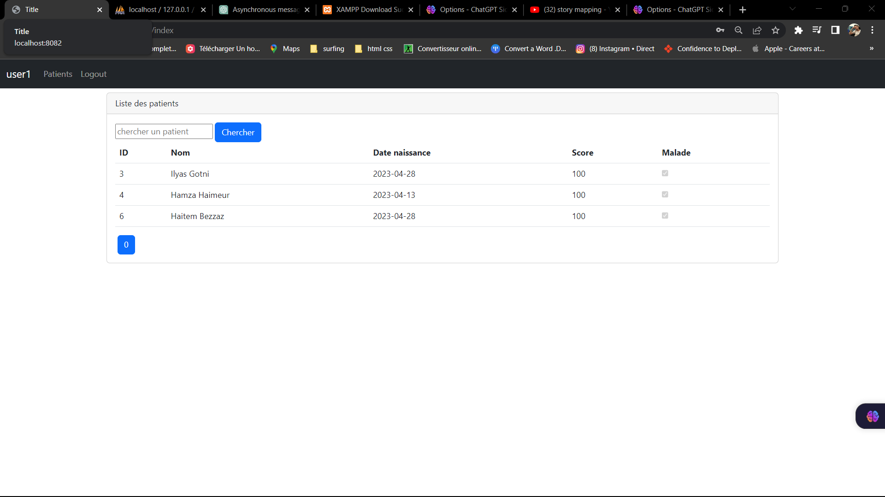

<h1>Rapport Projet Hospitalier(Gestion Patients) securisé</h1>

Entité Patient

Patient repository

Patient Controller

Securité Controller

Configuration securité

Template de decoration

Page patients

Formulaire ajout

Modifier patients

NoAuthorized page

main

propriétes app

Login

Utilisateur accueil

liste des patient par user2

liste des patient par user3

Se deconnecter

Administrateur accueil

Supprimer

Modifier

Ajouter

